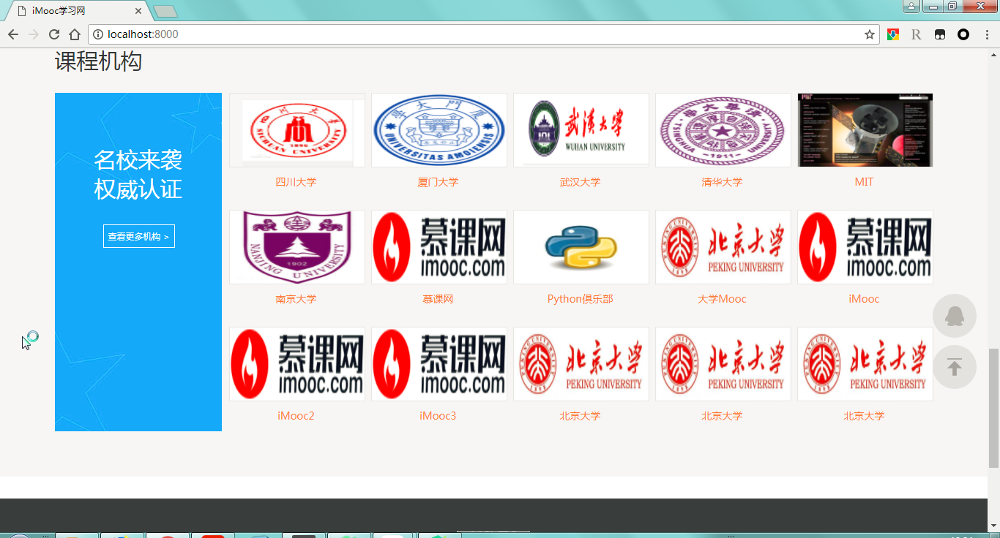
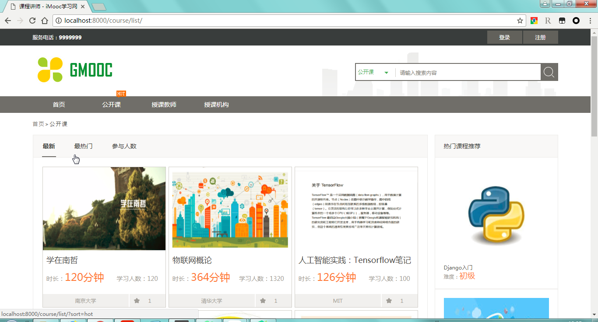
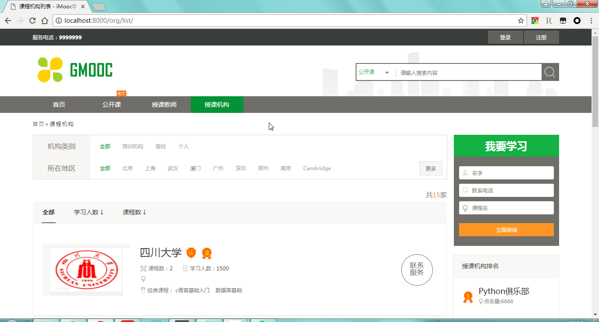
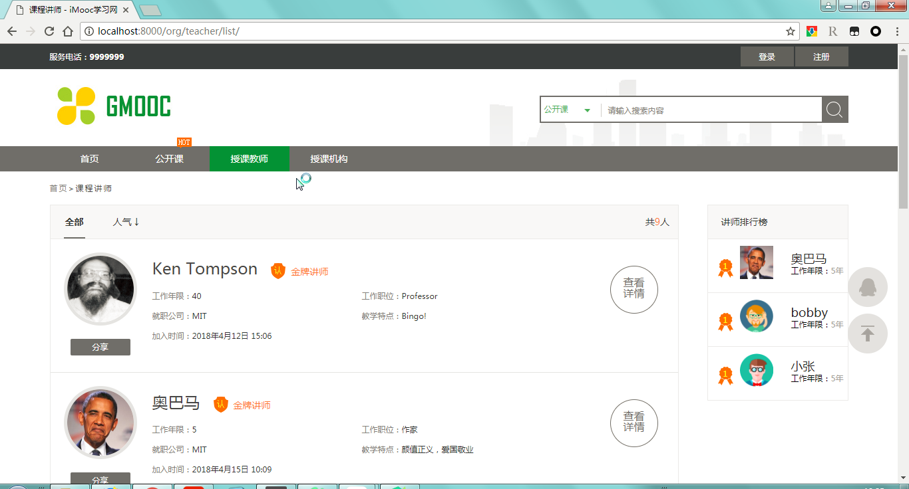

# imooc Background Management System

### 利用Django和xadmin建构的慕课网课程后台管理界面

```  python
# 依赖库文件
Django==1.9
django-crispy-forms==1.7.2
django-formtools==2.1
django-pure-pagination==0.3.0
django-ranged-response==0.2.0
django-simple-captcha==0.5.6
DjangoUeditor==1.8.143
future==0.16.0
httplib2==0.11.3
Pillow==5.1.0
PyMySQL==0.8.0
six==1.11.0

```

### 应用设置

* users：完成用户管理
* organization:  课程资源管理
* operation: 用户咨询，评论，收藏，留言功能的实现
* courses:课程管理应用

### 项目展示

#### 主页




### 公开课页面




### 授课机构页面




### 授课讲师页面

